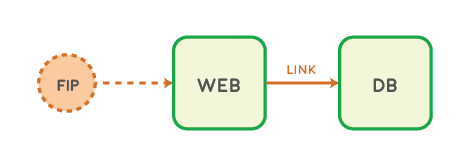

title: "Hyper Use Case Week - Part 1: Web app with a database"
date: 2016-05-03 20:00:00 +0800
author: hyper
preview: The Hyper_ public beta opened it arms to the world on April 4th 2016. The thing about public betas is that you really want to know what your users are doing on the platform. We see all sorts of actions occurring, but the patterns take a while to emerge. Now, a month into the public beta we've decided to share some of the most common patterns as part of Hyper Use Case Week.

---

The [Hyper_ public beta](https://console.hyper.sh/register) opened it arms to the world on April 4th 2016.

The thing about public betas is that you really want to know what your users are doing on the platform. We see all sorts of actions occurring, but the patterns take a while to emerge. Now, a month into the public beta we've decided to share some of the most common patterns as part of Hyper Use Case Week.

The use cases are not groundbreaking, but what we love to see is the ease and speed with which people are getting up and running.

### Use Case 1 - Web app with a database

The bread and butter of web development. Deploy your web app, attach it to a database, and then make it accessible to the outside world via a floating IP.



#### How do I do it?

It's not rocket science but registered Hyper_ users are achieving this deployment in under 10 seconds! Here's how:

``` shell
hyper run -d --name db hyperhq/postgres
hyper run -d --name web --link db hyperhq/webapp python app.py
FIP=$(hyper fip allocate 1)
hyper fip attach $FIP web
curl $FIP:80
> Hello: linked database is "tcp://<ip_of_db>"
```

Obviously this is a Python web app, but if your application runs in a container, it will run on Hyper_.

#### Deploying 2 containers in under 10 seconds, so what?

Deploying 2 containers in under 10 seconds in production may be no biggy for you. You already provisioned your virtual machines, set up the firewall rules and attached public IPs. Maybe you went ahead and installed scheduling and orchestration tooling.

After all that, sure, you can go ahead and deploy 2 containers in way less than 10 seconds, but you first had to do all that **and now you have to maintain it all**.

With Hyper_ the longest part of the use case is signing up for the public beta.

Why not get started now? [https://console.hyper.sh/register](https://console.hyper.sh/register)

**Now check out** part 2 now where we look at [Load balancing across two web servers](https://blog.hyper.sh/hyper-use-case-week-part-2-load-balancer-with-two-web-servers.html). Questions? Drop us a mail at [contact@hyper.sh](mailto:contact@hyper.sh).
